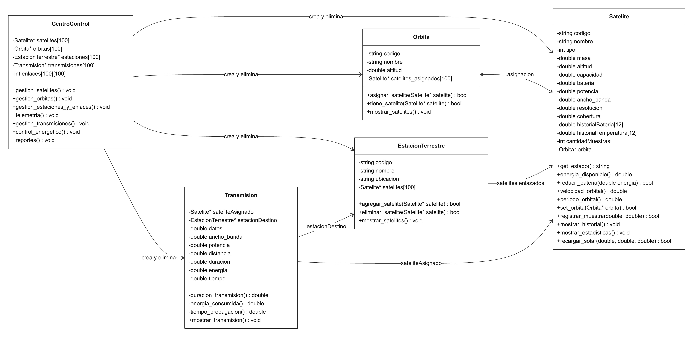

# Documento técnico

Repositorio en GitHub: https://github.com/PaolaEspH/Proyectos_Progra_II

El programa está dividido en cinco clases. Cada una guarda sus datos y tiene los métodos correspondientes. `CentroControl` administra los objetos y las operaciones del menú.

## Diagrama de clases

El gráfico incluye los atributos y métodos principales. Las flechas indican las relaciones entre los objetos.

## Clases

| Clase | Función |
| --- | --- |
| `CentroControl` | Guarda los registros y la matriz de enlaces, realiza búsquedas y muestra los reportes. |
| `Satelite` | Guarda los datos del satélite, calcula sus valores orbitales y maneja la batería y la telemetría. |
| `Orbita` | Guarda los datos de la órbita y los satélites asignados. |
| `EstacionTerrestre` | Guarda los datos de la estación y los satélites enlazados. |
| `Transmision` | Guarda los datos del envío y calcula su duración, propagación y consumo. |

## Punteros y memoria

Los objetos se crean con `new` y se guardan en los arreglos de punteros de `CentroControl`. Al cerrar el programa, su destructor los libera con `delete`. Primero se liberan las transmisiones, luego las estaciones y las órbitas, y por último los satélites.

- Una órbita guarda punteros a los satélites asignados. Cada satélite también guarda el puntero a su órbita; si todavía no tiene una, queda en `nullptr`.
- Una estación guarda punteros a los satélites con los que tiene enlace.
- Una transmisión guarda un puntero al satélite y otro a la estación del envío.

Estos punteros hacen referencia a los mismos objetos registrados en `CentroControl`. Por eso, las órbitas, estaciones y transmisiones no eliminan los satélites que tienen asociados.

## Arreglos fijos

`CentroControl` tiene cuatro arreglos de punteros: `satelites`, `orbitas`, `estaciones` y `transmisiones`. Cada uno permite hasta 100 registros. Sus posiciones empiezan en `nullptr` y cada registro nuevo se guarda en una posición libre. Las búsquedas y los reportes recorren los arreglos mediante bucles.

Las órbitas y las estaciones también tienen arreglos de hasta 100 punteros a satélites. Al quitar un enlace, el arreglo de la estación se acomoda para que no queden espacios vacíos entre sus satélites.

Cada satélite tiene dos arreglos de telemetría de 12 posiciones, llamados `historialBateria` e `historialTemperatura`. Los valores de una misma muestra se guardan en el mismo índice. `cantidadMuestras` indica cuántas posiciones están ocupadas y cuál sigue disponible.

Los promedios, mínimos y máximos se calculan solo con las muestras registradas. Cuando se completan las 12 posiciones, se informa que el historial está lleno y se conservan los datos anteriores. 

## Matriz de enlaces

La matriz `enlaces` tiene 100 filas y 100 columnas. Cada fila corresponde a una posición del arreglo de satélites y cada columna a una posición del arreglo de estaciones. Se inicializa en cero y  un `1` indica que hay enlace y un `0` que no lo hay.

Al crear o eliminar un enlace se actualizan la celda de la matriz y el arreglo de satélites de la estación. Antes de transmitir se comprueba que la celda correspondiente tenga un `1`.

La impresión muestra las filas y columnas de los objetos registrados, con sus códigos como encabezados. Para contar los enlaces activos se suman los valores de cada fila y columna mediante bucles.

## Diseño

Cada clase maneja los datos y cálculos que le corresponden. `CentroControl` reúne los registros y libera los objetos, mientras las demás clases guardan punteros a esos mismos objetos para no duplicarlos. Los arreglos fijos y la matriz se usan como pide el enunciado.
